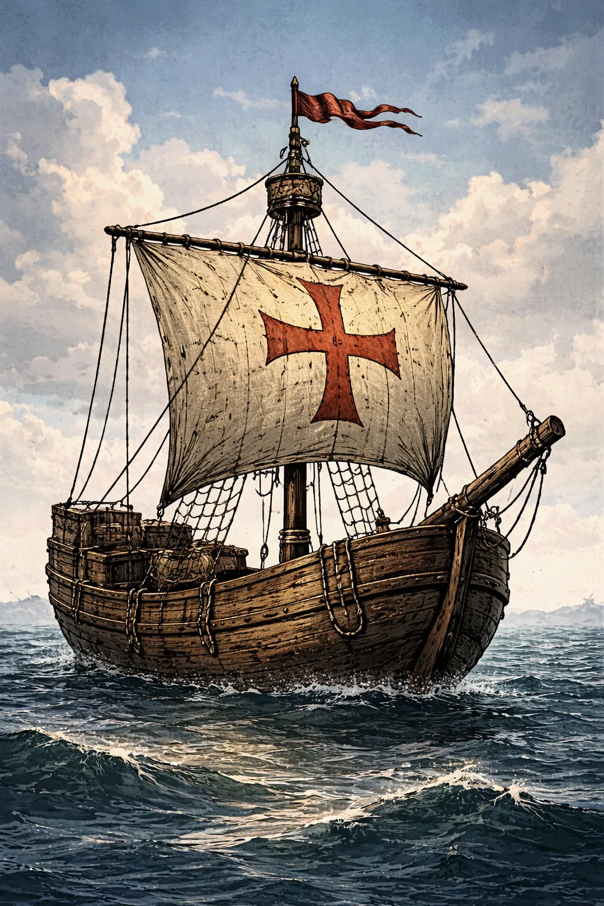
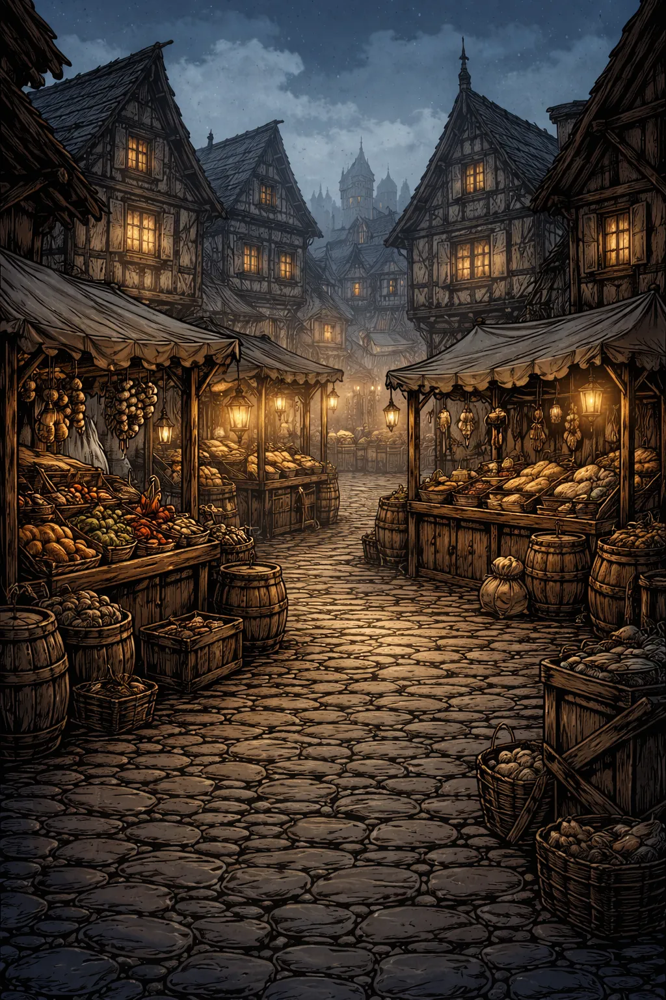
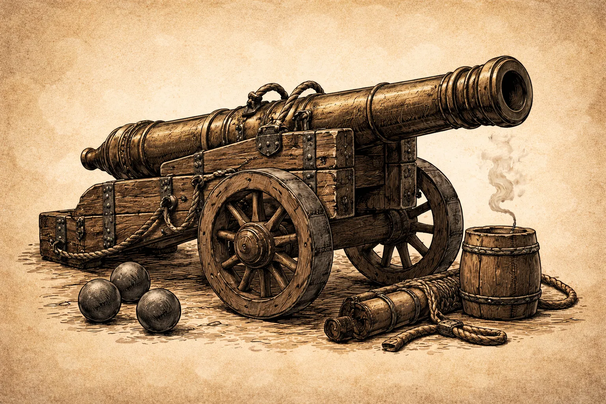

# HANSE: ATHERIA EDITION - Spielhandbuch




## 0) Patchnotes (Stand 2026-02-25)

**Patch-ID:** `P-2026-02-25`  
**Dokustand:** `2026-02-25`  
**Save-Version:** `2` (Legacy-Saves ohne Weltwirtschaftsdaten bleiben ladefaehig)

Enthaltene Erweiterungen:

- **Dynamische Weltwirtschaft:** Physische Stadtinventare pro Ware, echte Marktbestaende.
- **Produktion:** Rezeptbasierte Betriebe je Stadt (Inputs/Outputs, Level-Skalierung, Aktivstatus, Grundverbrauch).
- **NPC-Handel:** KI-Haendler mit Arbitrage, die Waren zwischen Staedten bewegen und so Preise indirekt veraendern.
- **Preislogik erweitert:** Zusaetzlicher `Inventory-Faktor` fuer Knappheit/Ueberfluss je Stadt und Ware.
- **Jahrhundertwechsel/Freischaltungen:** Neue Waren, Schiffstypen, Titelstufen und Waffenprofile werden automatisch aktiv.
- **Auto-Aufwertung im Auto-Modus:** Neue Gueter werden automatisch gehandelt; neue Schiffe/Kanonen gemaess aktueller Jahrhundert-Technik genutzt.
- **Flottenmodernisierung:** Schiffe koennen im Hafen verkauft werden, um auf neue Jahrhundertmodelle umzusteigen.
- **Mehr Quests:** Acht parallele Langzeitmissionen statt nur der vier Basisziele.
- **Betriebsinspektion:** Weltwirtschafts-Menue (CLI) und Stadtmarktansicht (pygame) zeigen Betriebsdetails je Stadt.
- **CSV-Export:** Voller Wirtschafts- und Spielerreport fuer Excel-Auswertung.
- **Beteiligungsmarkt:** Spieler kann Anteile an staedtischen Betrieben kaufen und passive Rendite erhalten.
- **Politischer Einfluss & Stadtrettung:** Einfluss pro Stadt steigt durch Investitionen; Rettungsfonds koennen bankrotte Staedte stabilisieren.

## 1) Titelblatt & Basisdaten

| Feld | Inhalt |
|---|---|
| Spielname | **Hanse: Atheria Edition** |
| Version | **1.0.0** |
| Plattformen | PC (Windows/Linux via Python + pygame), Android (Buildozer APK) |
| Entwickler | HANSE_ATHERIA Projektteam |
| Publisher | ATHERIA Games (Projektlabel) |
| Copyright | Copyright (c) HANSE_ATHERIA Projekt. Alle Rechte vorbehalten. |
| Altersfreigabe | Aktuell nicht offiziell USK/PEGI eingestuft |

**Key Art / Cover-Art**


---

## 2) Einleitung (Intro / Willkommen)

Willkommen in der Welt der Hanse im 14. Jahrhundert.  
Du fuehrst ein Handelshaus, baust eine Flotte auf, verlaedst Waren, befaehrst die Ost- und Nordsee und behauptest dich gegen Sturm, Piraten und wirtschaftliche Turbulenzen.

**Genre:** Wirtschafts- und Handelssimulation mit Flottenmanagement  
**Kernziel:** Vermoegen aufbauen, Missionen abschliessen, Dynastie sichern  
**Spielerrolle:** Leiter eines hanseatischen Handelshauses

---

## 3) Installation & Systemanforderungen

### PC - Mindestanforderungen

- Betriebssystem: Windows 10/11 oder aktuelles Linux
- CPU: 2 Kerne, ca. 2.0 GHz
- RAM: 4 GB
- GPU: OpenGL-faehige Grafikeinheit
- Speicherplatz: ca. 2 GB inkl. Python/Abhaengigkeiten
- Runtime: Python 3.11+ empfohlen

### PC - Empfohlene Anforderungen

- CPU: 4 Kerne, 2.5+ GHz
- RAM: 8 GB
- GPU: Dedizierte oder moderne iGPU
- SSD-Speicher empfohlen

### Android (APK)

- Android 5.0+ (API 21)
- ARMv7 oder ARM64
- 2 GB RAM empfohlen

### Installationsschritte (PC)

```bash
python -m venv .venv
# Windows:
.venv\Scripts\activate
# Linux/macOS:
# source .venv/bin/activate

pip install --upgrade pip
pip install -r requirements.txt
python HP_Game/main_pygame.py
```

### Installationsschritte (Android Build)

Siehe Build-Anleitung in `HP_Android/README.md`.

### Troubleshooting

- `ModuleNotFoundError: pygame`  
  Loesung: `pip install -r HP_Game/requirements-pygame.txt`
- Schwarzer Bildschirm / Startproblem auf Android  
  Loesung: APK fuer passende Architektur bauen (`arm64-v8a`, `armeabi-v7a`)
- ATHERIA-Runtime nicht gefunden  
  Loesung: Spiel laeuft im Fallback-Modell weiter; optional `HP_GAME_ATHERIA_ROOT` setzen

---

## 4) Steuerung (Controls)

### Tastatur (global)

| Aktion | Taste |
|---|---|
| Menues schliessen / Zurueck | `ESC` (Android: Back-Key) |
| Menge erhoehen | `+` / `=` / Numpad `+` |
| Menge verringern | `-` / Numpad `-` |
| Slot speichern | `F5` |
| Slot laden | `F9` |
| CSV-Report exportieren (pygame) | `F6` |

### Texteingabe

| Aktion | Taste |
|---|---|
| Bestaetigen (Setup / Name / Cheat) | `Enter` |
| Zeichen loeschen | `Backspace` |
| Cheat-Konsole oeffnen | `|` |
| Cheat-Code | `HANSE` |

### Maus / Touch

| Aktion | Eingabe |
|---|---|
| Buttons / Listen auswaehlen | Linksklick / Touch-Tap |
| Scroll in Marktliste | Mausrad / Pfeile `^` `v` im Marktkopf |
| Scroll in Flottenliste | Mausrad / Touch-Drag im Flottenpanel / Pfeile `^` `v` |
| Warentransfer im Lademenue | Drag auf Slider |
| Spielerprofil oeffnen | Button `Info` im Hauptbildschirm |

### Android-Spezifika

- On-Screen-Tastatur wird automatisch bei aktiver Texteingabe geoeffnet.
- Ohne aktive Tastatur nutzt die Spielansicht den verfuegbaren Bildschirm wieder voll aus.
- Flottenliste ist fuer Touch-Drag optimiert; alternativ stehen Scroll-Pfeile im Flottenkopf bereit.
- Marktliste ist ebenfalls per Scroll-Pfeilen bedienbar, damit auch viele Waren im Jahrhundertwechsel erreichbar bleiben.
- Bei fehlendem externem ATHERIA-Runtime-Aufruf wird auf Android automatisch **ATHERIA mobil** statt Fallback-Modell genutzt.
- Menue-Button **Beenden** beendet die App sauber per `SystemExit`.

---

## 5) Spielmechaniken (Core Systems)



### 5.1 Zeitmodell und Tick-Reihenfolge

Das Spiel arbeitet im **Monatsrhythmus**. Ein Monatswechsel ist nicht nur ein Kalenderupdate, sondern ein kompletter Simulationsschritt:

1. Neuer Seezustand und ATHERIA-Refresh fuer den Monat
2. Weltwirtschafts-Tick: Produktion in allen Staedten (Betriebe + Grundverbrauch)
3. NPC-Haendler-Tick: Arbitrage-Kaeufe/Reisen/Verkaeufe zwischen Staedten
4. Spielerphase (Handel/Flotte/Menues)
5. Laufende Kosten, Finanzlogik, Missions-/Titel-Update und Monatsinkrement

Dadurch entsteht ein klarer Spielpuls: **Planen -> Ausfuehren -> Risiko -> Auswertung**.

### 5.1.1 Produktionssystem und Stadtinventare

Jede Stadt besitzt eine eigene Weltwirtschaft mit:

- physischem `inventory` pro Ware
- Produktionsbetrieben (`buildings`) mit `level` und `active`
- optionaler `treasury` fuer laufende Kosten

Produktionslogik pro Monat:

1. Für jedes aktive Gebaeude werden die Inputwaren geprueft.
2. Sind Inputs vorhanden, werden sie verbraucht und Outputs erzeugt.
3. Inputs/Outputs skalieren linear mit dem Gebaeude-Level.
4. Fehlen Inputs, pausiert das Gebaeude in diesem Monat.

Zusätzlich gibt es einen kleinen stadtweiten Grundverbrauch fuer Basiswaren (`Getreide`, `Salz`, `Hering`), damit Maerkte nicht statisch bleiben.

Beispiele fuer Startbetriebe:

- Luebeck: Brauerei (u. a. Produktion von **Bier**)
- Bergen: Holzfaeller
- Riga/Novgorod: Salzmine

Aktive Standardrezepte:

- **Brauerei:** Getreide + Holz -> Bier
- **Salzmine:** -> Salz
- **Holzfaeller:** -> Holz
- **Fischerei:** -> Hering
- **Getreidehof:** -> Getreide
- **Weinkellerei:** Getreide -> Wein
- **Weberei:** Holz -> Tuch
- **Gerberei:** Salz -> Pelze

Jahrhundert-Freischaltungen (zusätzliche Betriebe):

- **15. Jh.:** Hopfenplantage, Teerbrennerei, Grossbrauerei
- **16. Jh.:** Gewuerzhandel, Kupfermine, Gewuerzraffinerie
- **17. Jh.:** Tabakplantage, Zuckerplantage, Zuckerraffinerie
- **18. Jh.:** Kaffeeplantage, Baumwollfarm, Textilmanufaktur
- **19. Jh.:** Kohlemine, Stahlwerk, Raffinerie
- **20. Jh.:** Elektronikfabrik
- **21. Jh.:** Seltene Erden Mine, Chipfabrik

Jede Stadt startet deterministisch mit **mindestens vier Betrieben**, Kernstaedte mit hoeheren Levels.

Dadurch entsteht reale Warenstroemung ohne Spieleraktion: Produktion fuellt Maerkte, Handel leert Maerkte.

### 5.2 Markt- und Preisbildung

Die Preise werden pro Stadt, Ware und Monat dynamisch berechnet. Die Kernformel lautet:

`Preis = Basispreis * Stadt-Bias * See-Faktor * (1 + Drift) * Globales Preisniveau * Stadt-Faktor * Waren-Faktor * Inventory-Faktor`

- `Basispreis`: statischer Grundwert pro Ware
- `Stadt-Bias`: strukturelles Stadtprofil (z. B. Holz guenstig in Nord-/Osthaefen)
- `See-Faktor`: aktueller Zustand (`stille See` bis `tobende See`)
- `Drift`: Zufall im Bereich der Waren-Volatilitaet
- `Globales Preisniveau`, `Stadt-Faktor`, `Waren-Faktor`: Makroeinfluss aus ATHERIA
- `Inventory-Faktor`: lokaler Knappheits-/Ueberflussfaktor aus dem realen Stadtbestand
- Untergrenze: Ein Preis faellt nie unter 6 Mark

Die Stadtbestaende sind physisch: Produktion, NPC-Handel und Spielerhandel veraendern denselben Warenpool.

### 5.3 Lager-, Verlade- und Preisbindungs-System

Das Handelshaus besitzt **stadtbezogene Lager**. Schiffe sind davon getrennt:

- Markt-Kauf geht zuerst immer ins Stadtlager
- Verkauf erfolgt aus dem Stadtlager
- Verladen verschiebt Mengen aus dem Lager in den Schiffsraum
- Beim Kauf sinkt der physische Stadtmarktbestand, beim Verkauf steigt er

Wichtiger Spezialfall: **Preisbindung bei Reisebeginn**  
Wenn ein Schiff mit Ladung auslaeuft, werden Zielortpreise je Ware als gebundene Lots gespeichert.

- Bei Ankunft und Entladen bleibt diese Bindung erhalten
- Beim Verkauf werden zuerst gebundene Lots verbraucht, danach aktueller Spot-Marktpreis

Das erlaubt strategisches Hedging gegen spaetere Marktschwankungen.

### 5.4 Reisen, ETA und Flottenzustand

- Jedes Schiff reist separat (`is_at_sea`, `destination`, `travel_turns_left`)
- Reisezeit in Monaten basiert auf Distanz zwischen Staedten
- Reisekosten wachsen mit Distanz
- Der aktive Status zeigt Ort, ETA und letzte Ereignismeldung

Eine Flotte kann parallel:

- im Hafen handeln/reparieren
- auf See in unterschiedlichen Zielkorridoren unterwegs sein

### 5.5 Seerisiko, Kampf und Schadensmodell


Sturm- und Kaperlogik sind seezustandsabhaengig.

- Sturmchance steigt mit rauer See
- Sturmschaden trifft Rumpf und Takelage separat
- Piratenchance wird durch Kanonen reduziert

Piratenformel:

`Chance_verlust = Risiko_See / (1 + Kanonen * 0.5)`

Effekte eines Angriffs:

- Warenverlust einzelner Gueter
- Reputationsverlust (durch Bewaffnung abgefedert)
- Eventlog in Chronik und Schiffsstatus

### 5.6 Schiffbau, Wartung und Bewaffnung



Verfuegbare Schiffstypen:

- **Grosse Kogge**: fruehes Ausbau-Schiff
- **Holk**: mittleres Transportprofil
- **Kraier**: hohes Endgame-Laderaumprofil

Weitere Regeln:

- Schiffe koennen individuell benannt werden
- Reparaturen erfolgen prozentual (Rumpf/Takelage)
- Kanonen sind stueckweise kaufbar und beeinflussen Risiko direkt

### 5.7 Finanzsystem, Schulden und Fortschritt

Monatliche Kosten:

- Heuer skaliert mit Flottenkapazitaet und Wirtschaftslage
- Schulden wachsen ueber monatlich abgeleiteten Zins
- Automatische Tilgung greift bei guter Liquiditaet

Kritische Schwelle:

- Hohe Schulden koennen zu Schuldturm-Runden fuehren
- Im Schuldturm sind zentrale Aktionen blockiert

Progressionsanker:

- Netto-Wert (Liquiditaet + Waren + Flotte - Schulden + Rufanteil)
- Titelaufstieg ueber Jahrhunderte mit zeitlicher Begrenzung pro Stufe

### 5.8 ATHERIA-Makrosystem

ATHERIA beeinflusst den Markt als Metaebene:

- `global_growth` (Wachstum)
- `global_price_level` (Preisniveau)
- `resource_scarcity` (Knappheit)
- zusaetzliche Stadt- und Warenfaktoren

Runtime-Verhalten:

- **PC/Notebook**: Es wird zuerst ein Live-Aufruf gegen die ATHERIA-Runtime versucht.
- **Android**: Falls kein externer Runtime-Aufruf verfuegbar ist, nutzt das Spiel automatisch ein eingebettetes **ATHERIA mobil**-Profil.
- Ohne gueltige ATHERIA-Daten nutzt die Simulation weiterhin ein robustes Fallback-Modell.

### 5.9 Missionen und Endgame-Anreize

Die Langzeitziele verknuepfen Handel, Flotte, Makrooekonomie und Dynastie:

- **Hanse-Privileg**: Lieferauftrag mit Frist in Knappheitsphasen; Reward: Stadtbonus
- **Architekt der Synergie**: Flottenkomposition + Zustand; Reward: Heuer-Reduktion
- **Atheria-Resonanz**: Netto-Wert-Skalierung in Rezession; Reward: Prestige/Meilenstein
- **Familiendynastie**: Familien- und Kapitalziel; Reward: Erbfortfuehrung statt hartem Reset
- **Braumeisterbund**: Bier-Absatzauftrag ueber mehrere Maerkte
- **Nordholz-Vertrag**: Holz-Volumenquest fuer Langstreckenhandel
- **Routenmeister**: Mindestens 6 verschiedene Staedte aktiv anlaufen
- **Arsenal der Hanse**: Flotte auf Zielzahl bei Schiffen und Kanonen ausbauen
- **Betriebskampagnen:** Fuer **jeden** Betrieb gibt es **8 Queststufen** (verkaufsbasiert auf Outputware, mit Staffel-Rewards)

### 5.10 Auto-Modus (Atheria-Autopilot)

Der `Auto`-Button uebergibt die Kontrolle an Atheria:

- automatischer Handel (Einkauf, Verkauf, Verladen)
- automatische Routenwahl mit Zielpreis-/Margenlogik
- Schiffbau, Reparaturen und Kanonen-Upgrades
- Monatsfortschritt ohne manuellen Eingriff
- Heiratsanfragen erscheinen auch im Auto-Modus als Popup und werden nach kurzer Anzeigedauer beantwortet
- Progression ist bewusst gebremst (Trade-Budget-Anteil, Schiffbau-Cooldown, Titel-Monatsgating)
- Mit Jahrhundertwechseln nutzt der Auto-Modus automatisch neue Handelsgueter, neue Schiffstypen und neue Waffentechnologien
- Kanonenkaeufe orientieren sich dynamisch am aktiven Waffenprofil des aktuellen Jahrhunderts (Kosten/Wirkung)

Der Lauf endet automatisch bei:

- Meldung `Zeitlimit erreicht. Lade einen Slot oder starte neu.`
- Verlustbedingung ohne fortsetzbare Ressourcen

### 5.11 Jahrhundertwechsel, Freischaltungen und automatische Aufwertung

Mit jedem neuen Jahrhundert erweitert sich die Spielwelt automatisch:

- neue Waren werden freigeschaltet und in Markt, Lager, Produktion und Preisbildung integriert
- neue Schiffstypen werden in der Werft verfuegbar
- neue Titelstufen werden aktiv
- das Waffenprofil (Kanonenname, Kosten, Wirkung, Limits) steigt auf die jeweilige Technikstufe

Automatisches Verhalten:

- Der Auto-Modus handelt neue Waren ohne Extra-Konfiguration, sobald sie verfuegbar sind.
- Beim Schiffbau greift er auf das aktuell freigeschaltete Werftangebot zu.
- Bei Wartung/Aufruestung kauft er Kanonen auf Basis der aktiven Jahrhundert-Technik.
- Die Werft zeigt pro Jahrhundert nur aktuelle Schiffsmodelle; veraltete Modelle sind nicht mehr kaufbar.
- Im Schiff-Editor lassen sich Kanonenstufen (alt bis neu) waehlen und gezielt montieren.

Manuelles Ersetzen alter Schiffe:

- Alte Schiffe koennen im Hafen verkauft werden (nicht auf See, nicht beladen, letztes Schiff ist gesperrt).
- So lassen sich Flotten gezielt gegen neue Jahrhundertmodelle austauschen.

### 5.12 Anteilssystem, passive Rendite und Stadtrettung

Die Weltwirtschaft besitzt einen zusaetzlichen **Beteiligungsmarkt** pro Stadt und Betrieb.

- Anteilskauf erfolgt je Betrieb in Prozentpunkten (z. B. +5%).
- Der Anteilskurs wird aus Rezeptwert (Input/Output), Gebaeudelevel und Technologieepoche abgeleitet.
- Ein Teil des Kaufpreises fliesst direkt in die Stadtkasse.

Passive Rendite:

- Bei laufender Produktion entsteht je Betrieb ein monatlicher **Dividendenpool**.
- Deine Auszahlung ergibt sich aus `Dividendenpool * Anteil%`.
- Auszahlungen sind durch die reale Stadtkasse gedeckelt (keine unendliche Geldquelle).

Politischer Einfluss:

- Anteilskauf und Dividenden steigern den stadtbezogenen Einflusswert.
- Einfluss ist stadtlokal und wird im Status/Weltwirtschaftsfenster angezeigt.

Stadtrettung bei Bankrott:

- Unterhalb eines kritischen Kassenwerts gilt eine Stadt als bankrottgefaehrdet.
- In diesem Zustand laufen Betriebe gedrosselt und Preise erhalten einen Krisenaufschlag.
- Mit ausreichendem Einfluss kann der Spieler einen **Rettungsfonds** einzahlen.
- Die Einzahlung hebt die Stadtkasse direkt an (mit Einflussbonus) und kann die Stadt wieder stabilisieren.

Bedienung:

- **CLI:** `Weltwirtschaft` -> Stadt waehlen -> `Anteile kaufen` / `Rettungsfonds`.
- **pygame:** `Stadtpreise`-Fenster -> Betrieb waehlen -> `+5% Anteil` bzw. `Rettung 1000`.

---

## 6) UI-Erklaerung (Interface Guide)


Die Hauptoberflaeche besteht aus vier Kernbereichen:

1. **Top-Statusleiste**  
   ANNO/Monat, Seezustand, Spielerwerte, aktives Schiff, ATHERIA-Kennzahlen.
2. **Marktpanel (links)**  
   Warenliste mit Preis, Lagerbestand und Zielpreisvorschau; Scroll per Mausrad oder `^`/`v`.
3. **Flottenpanel (mitte)**  
   Alle Schiffe, Standort, Ladung, Zustand, Kanonen; Scroll per Touch-Drag, Mausrad oder `^`/`v`.
4. **Aktionspanel (rechts)**  
   Kaufen/Verkaufen, Menge, Ladung, Schiffbau, Editor, Reparaturen, Monatswechsel, `Auto`, `Info`, Save/Load.

Zusatzfenster:

- **Stadtpreise**: Preise jeder Stadt im aktuellen Monat
- **Missionen**: Fortschritt aller Langzeitziele
- **Info**: Gesamtstatus des Spielers (Titel, Familie, Finanzen, Flotte, Missionen)
- **Schiffsladung**: Transfer Lager <-> Schiff + Reiseziel
- **Schiff-Editor**: Name + Kanonenkauf
- **Weltwirtschaft (CLI)**: Pro Stadt Betriebsliste inkl. Inputs/Outputs, Aktivstatus und Laufbarkeit
- **CSV-Export**: Vollreport ueber Stadtinventare, Betriebe, NPCs, Missionen und Flotte


---

## 7) Charaktere / Fraktionen

Die Spielwelt arbeitet weniger mit statischen Quest-NPCs und mehr mit **systemischen Fraktionen**, die dauerhaft auf deine Entscheidungen reagieren.

### 7.1 Das eigene Handelshaus (Spielerfraktion)

Rolle:

- Oekonomischer Kernakteur mit Flotte, Lager, Ruf, Schulden und Dynastie

Mechanischer Einfluss:

- Trifft alle Handels- und Reiseentscheidungen
- Definiert Risikoappetit (hohe Margen vs. sichere Routen)
- Formt den Langzeitverlauf ueber Missionen und Titel

Strategische Bedeutung:

- Liquiditaet, Ruf und Schiffszustand sind die drei kritischen Stabilitaetsachsen

### 7.2 Hanse-Staedte und Stadtraete

Rolle:

- Regionale Machtzentren mit eigenen Marktprofilen und Versorgungsinteressen

Mechanischer Einfluss:

- Stadt-Bias praegt Preise je Ware
- Missionen wie das Hanse-Privileg entstehen aus lokaler Knappheit
- Stadtlager erzwingen ortsgebundenes Logistikdenken

Strategische Bedeutung:

- Jede Stadt ist ein eigener Profit- und Risiko-Knoten
- Heimathafen-Strategien lohnen sich durch wiederkehrende Boni und kurze Logistikwege

### 7.3 Hafenmeister, Werften und Versorgungskontore

Rolle:

- Maritime Infrastrukturfraktion fuer Instandhaltung und Flottenwachstum

Mechanischer Einfluss:

- Schiffskauf, Reparatur und Kanonenaufruestung nur im Hafen
- Beschraenkt durch Liquiditaet und Standort des jeweiligen Schiffs

Strategische Bedeutung:

- Werften bestimmen die Skalierungsgeschwindigkeit
- Zu spaete Wartung fuehrt zu ueberproportionalem Totalverlustrisiko

### 7.4 Kaperverbaende und Piratenkartelle

Rolle:

- Gegenspieler auf See, die Handelsrouten destabilisieren

Mechanischer Einfluss:

- Warenverluste auf Reisen
- Reputationsschaden bei erfolgreichen Kaperungen
- Direkte Kopplung an Seezustand und Bewaffnung

Strategische Bedeutung:

- Erzwingen Sicherheitsinvestitionen (Kanonen, Risikostreuung, Routenwahl)
- Bestrafen ueberladene Einzelschiffe ohne Eskorte/Defensive

### 7.5 Die ATHERIA-Wirtschaftskraefte

Rolle:

- Uebergeordnete Makrofraktion, die Konjunktur und Knappheit treibt

Mechanischer Einfluss:

- Veraendert Margen, Kaufkraft, Kosten und Risiko indirekt in jedem Monat
- Triggert bestimmte Missionsfenster (z. B. Rezessionsziele)

Strategische Bedeutung:

- Erfolgreiche Spieler spielen nicht gegen einzelne Preise, sondern gegen den Zyklus
- Rezession und Knappheit sind keine reine Strafe, sondern Gelegenheitsfenster

### 7.6 Familie und Dynastie

Rolle:

- Soziale Kontinuitaetsfraktion des Handelshauses

Mechanischer Einfluss:

- Lebensereignisse (Ehe, Kinder, Tod)
- Dynastie-Mission kann den Spielabbruch in einen Nachfolge-Start ueberfuehren

Strategische Bedeutung:

- Verbindet Midgame-Wohlstand mit Endgame-Sicherheit
- Belohnt langfristige Planung statt reiner Kurzfristmaximierung

---

## 8) Spielmodi

- **Pygame Edition**: Grafischer Einzelspieler mit Vollfunktion.
- **CLI Edition**: Konsolenversion mit 1-6 Spielern (lokale Runden).
- **Save/Load**: 6 Save-Slots mit Zeitstempel und Kurzzusammenfassung.

Siegbedingung im klassischen Sinn ist offen gestaltet:  
Ziel ist der nachhaltige Aufstieg (Vermoegen, Titel, Flotte, Missionen, Dynastie).

---

## 9) Tipps & Strategien

- Kaufe frueh guenstige Grundwaren, verteile Risiken auf mehrere Schiffe.
- Halte immer Reparaturbudget bereit; Null-Rumpf bedeutet Schiffsverlust.
- Kanonen lohnen sich auf stark frequentierten Routen mit wertvoller Ladung.
- Nutze Stadtpreise und Zielpreisvorschau vor jeder Reise.
- Spiele Missionen aktiv an: Rabatt und Heuerbonus skalieren stark im Mid-/Late-Game.
- Ueberziehe den Kredit nicht dauerhaft, Schuldturm blockiert kritische Aktionen.

---

## 10) Glossar

- **ANNO**: Jahres-/Monatsanzeige des Spielfortschritts.
- **Ladung**: Aktuelle Warenmenge im Schiff.
- **Takelage**: Zustand von Mast/Segel (beeinflusst Seetauglichkeit).
- **Kaperangriff**: Piratenereignis mit Warenverlust.
- **Knappheit**: ATHERIA-Indikator fuer Ressourcenengpaesse.
- **Netto-Wert**: Geld + Warenwert + Flottenwert - Schulden + Rufanteil.
- **Heuer**: Laufende monatliche Flotten-/Crew-Kosten.

---

## 11) Rechtliches

- Dieses Handbuch und das Spielmaterial sind urheberrechtlich geschuetzt.
- Marken- und Namensrechte verbleiben bei den jeweiligen Rechteinhabern.
- Drittanbieter-Komponenten (u. a. Python, pygame/SDL, numpy, torch) unterliegen ihren jeweiligen Lizenzen.
- Lizenzdatei des Projekts: `LICENSE` im Repository-Stamm.

---

## Anhang: Bildverzeichnis (eingesetzte Assets)

- `images/bg_main.webp`
- `images/bg_setup.webp`
- `images/bg_market.webp`
- `images/bg_sea.webp`
- `images/bg_sea_wild.webp`
- `images/ship_kogge.webp`
- `images/icon_cannon.webp`
- `images/panel_stripe.webp`
- `images/paper_texture_chronik.webp`
- `images/paper_texture_transfer.webp`
