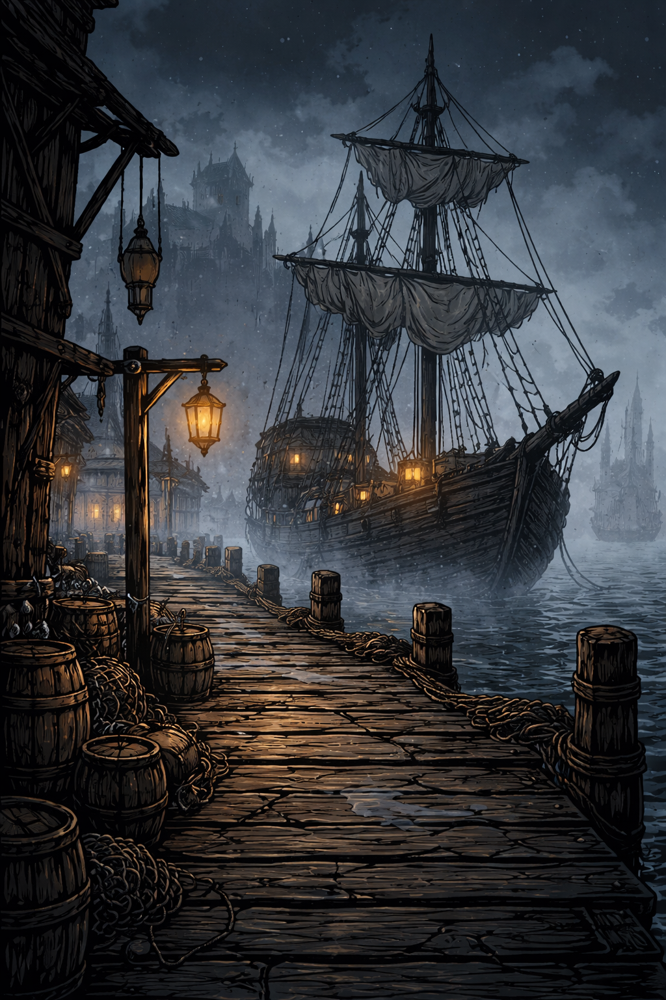
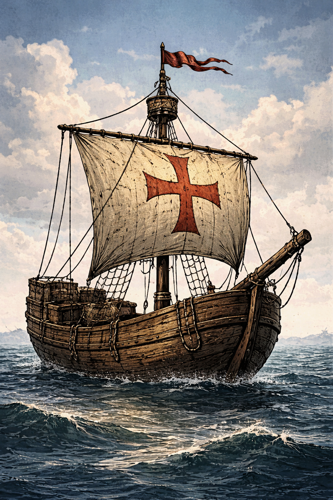
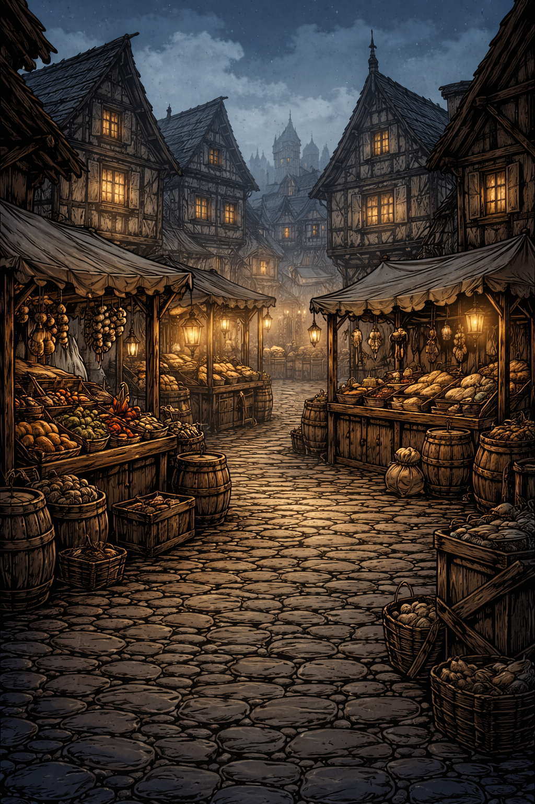
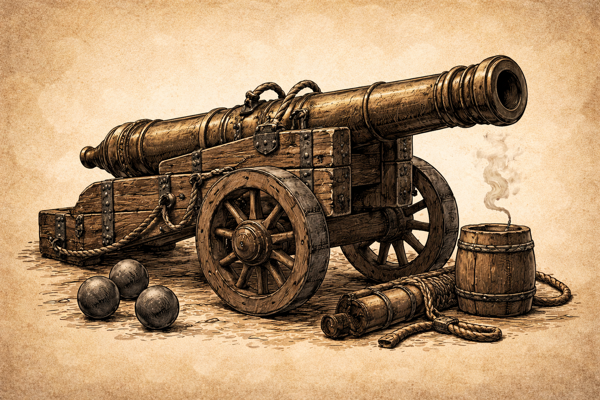

# HANSE: ATHERIA EDITION - Spielhandbuch





## 1) Titelblatt & Basisdaten

| Feld | Inhalt |
|---|---|
| Spielname | **Hanse: Atheria Edition** |
| Version | **1.0.0** |
| Plattformen | PC (Windows/Linux via Python + pygame), Android (Buildozer APK) |
| Entwickler | HANSE_ATHERIA Projektteam |
| Publisher | ATHERIA Games (Projektlabel) |
| Copyright | Copyright (c) HANSE_ATHERIA Projekt. Alle Rechte vorbehalten. |
| Altersfreigabe | Aktuell nicht offiziell USK/PEGI eingestuft |

**Key Art / Cover-Art**


---

## 2) Einleitung (Intro / Willkommen)

Willkommen in der Welt der Hanse im 14. Jahrhundert.  
Du fuehrst ein Handelshaus, baust eine Flotte auf, verlaedst Waren, befaehrst die Ost- und Nordsee und behauptest dich gegen Sturm, Piraten und wirtschaftliche Turbulenzen.

**Genre:** Wirtschafts- und Handelssimulation mit Flottenmanagement  
**Kernziel:** Vermoegen aufbauen, Missionen abschliessen, Dynastie sichern  
**Spielerrolle:** Leiter eines hanseatischen Handelshauses

---

## 3) Installation & Systemanforderungen

### PC - Mindestanforderungen

- Betriebssystem: Windows 10/11 oder aktuelles Linux
- CPU: 2 Kerne, ca. 2.0 GHz
- RAM: 4 GB
- GPU: OpenGL-faehige Grafikeinheit
- Speicherplatz: ca. 2 GB inkl. Python/Abhaengigkeiten
- Runtime: Python 3.11+ empfohlen

### PC - Empfohlene Anforderungen

- CPU: 4 Kerne, 2.5+ GHz
- RAM: 8 GB
- GPU: Dedizierte oder moderne iGPU
- SSD-Speicher empfohlen

### Android (APK)

- Android 5.0+ (API 21)
- ARMv7 oder ARM64
- 2 GB RAM empfohlen

### Installationsschritte (PC)

```bash
python -m venv .venv
# Windows:
.venv\Scripts\activate
# Linux/macOS:
# source .venv/bin/activate

pip install --upgrade pip
pip install -r requirements.txt
python HP_Game/main_pygame.py
```

### Installationsschritte (Android Build)

Siehe Build-Anleitung in `HP_Android/README.md`.

### Troubleshooting

- `ModuleNotFoundError: pygame`  
  Loesung: `pip install -r HP_Game/requirements-pygame.txt`
- Schwarzer Bildschirm / Startproblem auf Android  
  Loesung: APK fuer passende Architektur bauen (`arm64-v8a`, `armeabi-v7a`)
- ATHERIA-Runtime nicht gefunden  
  Loesung: Spiel laeuft im Fallback-Modell weiter; optional `HP_GAME_ATHERIA_ROOT` setzen

---

## 4) Steuerung (Controls)

### Tastatur (global)

| Aktion | Taste |
|---|---|
| Menues schliessen / Zurueck | `ESC` (Android: Back-Key) |
| Menge erhoehen | `+` / `=` / Numpad `+` |
| Menge verringern | `-` / Numpad `-` |
| Slot speichern | `F5` |
| Slot laden | `F9` |

### Texteingabe

| Aktion | Taste |
|---|---|
| Bestaetigen (Setup / Name / Cheat) | `Enter` |
| Zeichen loeschen | `Backspace` |
| Cheat-Konsole oeffnen | `|` |
| Cheat-Code | `HANSE` |

### Maus / Touch

| Aktion | Eingabe |
|---|---|
| Buttons / Listen auswaehlen | Linksklick / Touch-Tap |
| Scroll in Flottenliste | Mausrad / Touch-Scroll |
| Warentransfer im Lademenue | Drag auf Slider |

### Android-Spezifika

- On-Screen-Tastatur wird automatisch bei aktiver Texteingabe geoeffnet.
- Menue-Button **Beenden** beendet die App sauber per `SystemExit`.

---

## 5) Spielmechaniken (Core Systems)



### Zeit- und Rundenmodell

- Das Spiel laeuft **monatlich**.
- Oekonomie, Seezustand und laufende Effekte werden jeden Monat fortgeschrieben.
- Alter/Lebensereignisse werden jaehrlich aktualisiert.

### Handel & Lager

- Waren werden am Markt gekauft und im **Stadtlager** gespeichert.
- Verkauf erfolgt aus dem aktuellen Stadtlager.
- Preise sind staedte- und seegangsabhaengig und werden durch ATHERIA beeinflusst.

### Schiffsladung & Reisen

- Waren werden vom Lager in den Laderaum eines ausgewaehlten Schiffs transferiert.
- Jedes Schiff reist individuell und hat eigene ETA.
- Zielortpreise koennen beim Auslaufen fuer geladene Ware gebunden werden.

### Seerisiko (Sturm / Piraten)


- Stuerme verursachen Rumpf- und Takelage-Schaden.
- Piraten koennen Waren rauben.
- Kanonen reduzieren die Kaperwahrscheinlichkeit.

### Flottenmanagement

- Mehrere Schiffe gleichzeitig moeglich.
- Schiffstypen: **Grosse Kogge**, **Holk**, **Kraier**.
- Schiffe koennen benannt, repariert und mit Kanonen aufgeruestet werden.



### ATHERIA-Oekonomie

- Globale und lokale Marktparameter werden aus ATHERIA-Metriken abgeleitet.
- Faktoren: Wachstum, Preisniveau, Knappheit, Stadt- und Warenfaktoren.
- Bei fehlender Runtime wird ein Fallback-Modell verwendet.

### Missionen & Langzeitziele

- **Hanse-Privileg**: Stadtversorgungsziel (Getreide) mit Frist.
- **Architekt der Synergie**: Flottenstruktur-Ziel mit Heuer-Bonus.
- **Atheria-Resonanz**: Vermoegensziel waehrend Rezession.
- **Familiendynastie**: Kinder + Erbkapital als Nachfolgesystem.

---

## 6) UI-Erklaerung (Interface Guide)


Die Hauptoberflaeche besteht aus vier Kernbereichen:

1. **Top-Statusleiste**  
   ANNO/Monat, Seezustand, Spielerwerte, aktives Schiff, ATHERIA-Kennzahlen.
2. **Marktpanel (links)**  
   Warenliste mit Preis, Lagerbestand und Zielpreisvorschau.
3. **Flottenpanel (mitte)**  
   Alle Schiffe, Standort, Ladung, Zustand, Kanonen.
4. **Aktionspanel (rechts)**  
   Kaufen/Verkaufen, Menge, Ladung, Schiffbau, Editor, Reparaturen, Monatswechsel, Save/Load.

Zusatzfenster:

- **Stadtpreise**: Preise jeder Stadt im aktuellen Monat
- **Missionen**: Fortschritt aller Langzeitziele
- **Schiffsladung**: Transfer Lager <-> Schiff + Reiseziel
- **Schiff-Editor**: Name + Kanonenkauf


---

## 7) Charaktere / Fraktionen

- **Spielerhaus**: Dein Handelshaus mit Ruf, Schulden, Familie und Chronik.
- **Hansestaedte**: Regionale Maerkte mit unterschiedlichen Preisprofilen.
- **Piraten/Kaperer**: Ereignisgesteuerte Gegenspieler auf See.
- **Wirtschaftskraefte (ATHERIA)**: Dynamische Meta-Einflussgroesse statt statischer Welt.

---

## 8) Spielmodi

- **Pygame Edition**: Grafischer Einzelspieler mit Vollfunktion.
- **CLI Edition**: Konsolenversion mit 1-6 Spielern (lokale Runden).
- **Save/Load**: 6 Save-Slots mit Zeitstempel und Kurzzusammenfassung.

Siegbedingung im klassischen Sinn ist offen gestaltet:  
Ziel ist der nachhaltige Aufstieg (Vermoegen, Titel, Flotte, Missionen, Dynastie).

---

## 9) Tipps & Strategien

- Kaufe frueh guenstige Grundwaren, verteile Risiken auf mehrere Schiffe.
- Halte immer Reparaturbudget bereit; Null-Rumpf bedeutet Schiffsverlust.
- Kanonen lohnen sich auf stark frequentierten Routen mit wertvoller Ladung.
- Nutze Stadtpreise und Zielpreisvorschau vor jeder Reise.
- Spiele Missionen aktiv an: Rabatt und Heuerbonus skalieren stark im Mid-/Late-Game.
- Ueberziehe den Kredit nicht dauerhaft, Schuldturm blockiert kritische Aktionen.

---

## 10) Glossar

- **ANNO**: Jahres-/Monatsanzeige des Spielfortschritts.
- **Ladung**: Aktuelle Warenmenge im Schiff.
- **Takelage**: Zustand von Mast/Segel (beeinflusst Seetauglichkeit).
- **Kaperangriff**: Piratenereignis mit Warenverlust.
- **Knappheit**: ATHERIA-Indikator fuer Ressourcenengpaesse.
- **Netto-Wert**: Geld + Warenwert + Flottenwert - Schulden + Rufanteil.
- **Heuer**: Laufende monatliche Flotten-/Crew-Kosten.

---

## 11) Rechtliches

- Dieses Handbuch und das Spielmaterial sind urheberrechtlich geschuetzt.
- Marken- und Namensrechte verbleiben bei den jeweiligen Rechteinhabern.
- Drittanbieter-Komponenten (u. a. Python, pygame/SDL, numpy, torch) unterliegen ihren jeweiligen Lizenzen.
- Lizenzdatei des Projekts: `LICENSE` im Repository-Stamm.

---

## Anhang: Bildverzeichnis (eingesetzte Assets)

- `images/bg_main.png`
- `images/bg_setup.png`
- `images/bg_market.png`
- `images/bg_sea.png`
- `images/bg_sea_wild.png`
- `images/ship_kogge.png`
- `images/icon_cannon.png`
- `images/panel_stripe.png`
- `images/paper_texture_chronik.png`
- `images/paper_texture_transfer.png`
